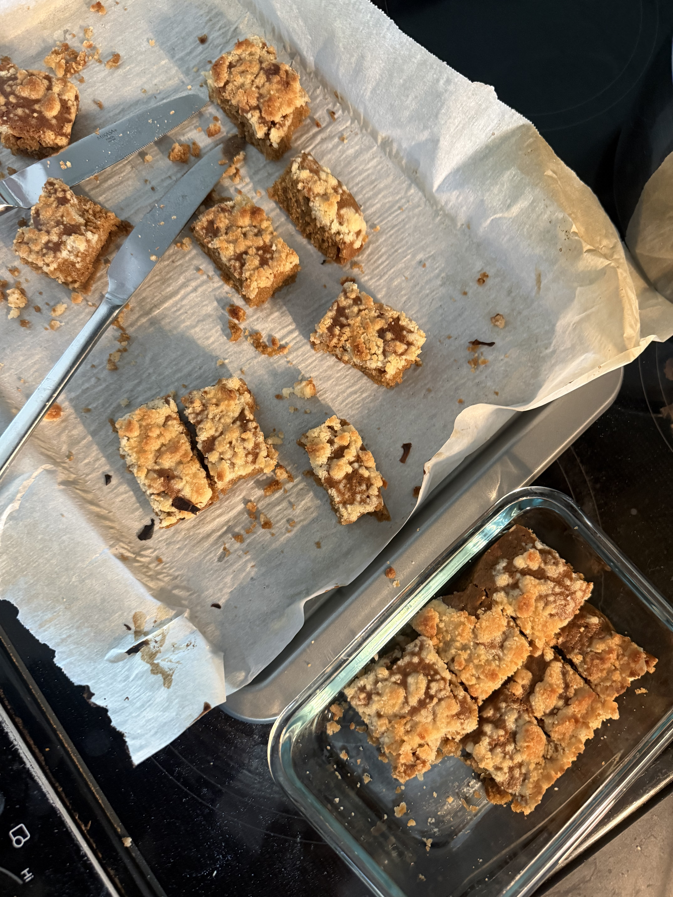
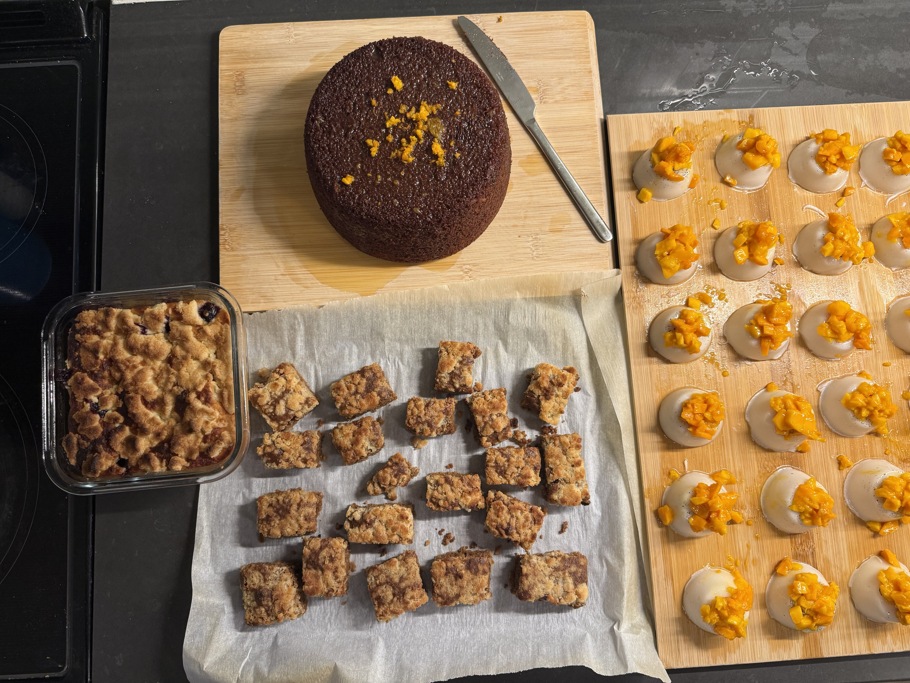

## Routine

I am someone who likes to follow some semblance of a routine to keep me sane, on the weekends at the very least. I always like to start my weekend mornings with a freshly made batch of masala chai. And while I am still on a journey of trying to replicate my aunt’s perfectly-balanced cup, I do believe that I can now confidently claim to make a decent enough cup. At least that was what I had thought, until this one Sunday morning in the summer. I started making my chai as I usually do, by taking a handful of whole spices to pound with a mortar and pestle. I add at least 7-8 pieces of cardamom, 2-3 cloves, 1 star anise, sometimes a sliver of cinnamon (which I tend to skip in the summers) and less than half a teaspoon of ajwain and saunf (a recent addition because of a friend’s recommendation). I boil these spices for a few minutes in water, until the volume of water halves in size, and then I add in half an inch of grated ginger. Once the water reduces, I add in the chai (dried black tea leaves) and let it simmer for only a minute or two. After that, I usually add in whole milk. 

The disaster began when I went to fetch milk and I saw that it had gone completely bad. It had basically separated into cheese curds and whey. At this moment, I was also distracted talking to my sister on the phone, and I will wrongly blame her for what happened next. I remembered that I had some coconut milk (not the canned kind, but the more stabilized drink that comes in a carton) lying around, and I thought that I could use it as a decent enough replacement for the whole milk. While I am deliberating all of this and talking on the phone, I forget to turn off or reduce the flame, so the chai is still boiling away to a point where the tea starts to oversteep and get extremely bitter. I now add in the watery coconut milk drink and let it simmer for another two minutes, before I switch off the flame. I usually drink my chai unsweetened, so I serve the chai and start drinking it. It was truly terrible; the tea tasted so bitter and it overpowered all the spices. Not to mention that the consistency was so watered down it was almost like I cried into the mug because of how bad it was. I could not bear to sip another sip of this, but I had made around two whole cups of this disaster. 

I really do not like wasting food, and I did not want to throw away this whole batch. I wondered what I could do, and then I remembered that I had a dinner party to attend at a friend’s house the next day. I started brainstorming dessert ideas and was very fixated on the idea of a coffee cake crumble but with a chai flavor instead. I started chatting with my favorite chatbot and it came up with a chai cake recipe that used up most of my concentrate. I am a very big fan of slop recipes and I love using AI to make recipes from what I have left in the fridge. I also have a rule-of-thumb when it comes to following any cake recipe that is more USA-centric; I always only use 50-75% of the amount of sugar that the recipe calls for, because it can get way too sweet for my palette. I also wanted to add a cardamom crumble topping and I asked my trusted chatbot to help me with that as well. Here is the chai crumble sheet cake recipe that I followed (after adjusting for my sugar preferences).

::: {#fig-cake}
{width="200" fig-align="center" fig-alt="Chai crumble cake that I rushed to make in 45 mins because I was running late for the dinner party"}

Chai crumble cake that I rushed to make in 45 mins because I was running late for the dinner party

:::

## Ingredients

Crumble:

- ½ cup all-purpose flor
- ½ cup granulated sugar
- ¼ melted unsalted butter
- Pinch of salt

Cake:

- 1 cup room-temperature or cooled coconut chai concentrate
- ½ cup neutral oil or melted butter
- 2 large eggs
- ¾ cup granulated sugar
- 1 ¾ cups all-purpose flour
- 1 ½ tsp baking powder
- ½ tsp baking soda
- ¾ tsp salt

Method:

1. Preheat your oven to 350 F (180 C) and grease a pan of your choice. Baking time varies with pan shape, and I used a sheet cake pan
2. Mix the crumble first. In a small bowl, toss together the flour, sugar, and salt. Pour in the melted butter and mix it together with a fork or your hands, until the consistency resembles wet sand. Set this aside.
3. Mix the wet ingredients for the cake. In a large mixing bowl, mix together the oil/butter, sugar, eggs, and the chai concentrate until it is totally smooth.
4. Add in the baking powder, baking soda, and salt. Mix it in the wet batter and ensure that it is well-distributed.
5. Fold in the flour until the batter is smooth and there are no streaks of dry flour. Pour the batter into your pan.
6. Bake the cake in your oven for 20-25 mins (for a sheet cake) or 40-45 mins (for a regular round thick cake). The cake is ready when a toothpick inserted in the middle comes out clean.

::: {#fig-many-cakes}
{width="300" fig-align="center" fig-alt="Chai crumble cake featured in the center of my \"clear-out-fridge\" bake, including a lemon-blueberry crumble cake (left), an orange chocolate cake (top), and a vegan coconut mango panna cotta (right)."}

Chai crumble cake featured in the center of my "clear-out-fridge" bake, including a lemon-blueberry crumble cake (left), an orange chocolate cake (top), and a vegan coconut mango panna cotta (right).

:::