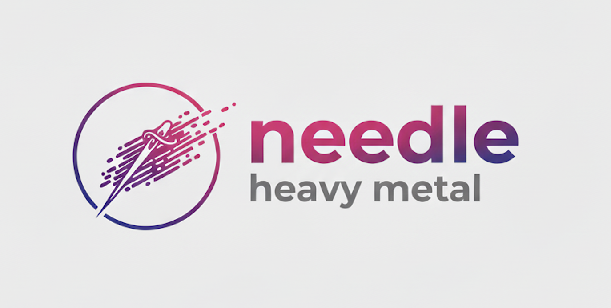
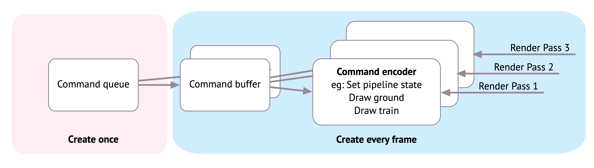
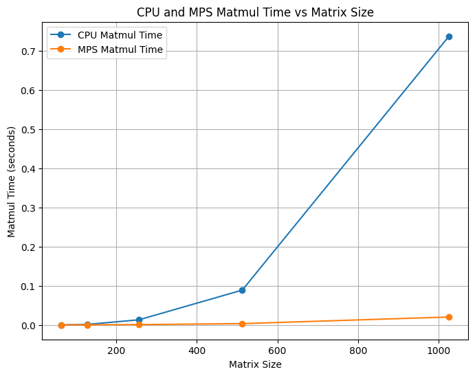
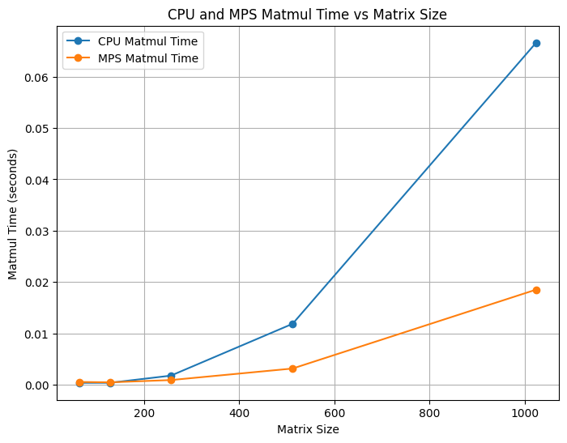
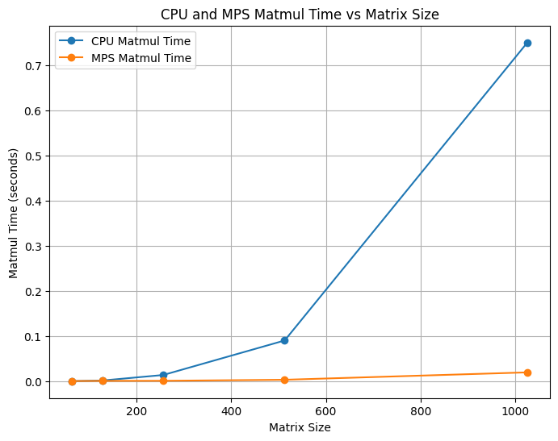
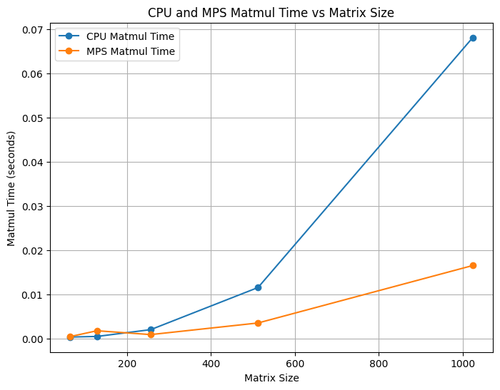
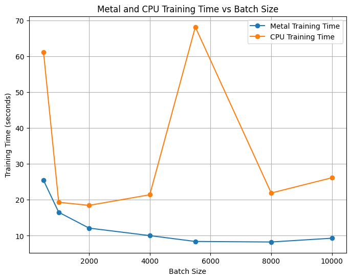

During my time at CMU, I was fortunate to be able to take what was one of my favorite courses in SCS -- [10-714: Deep Learning Systems](https://dlsyscourse.org/) taught by [Prof. Zico Kolter](https://www.cs.cmu.edu/~zkolter/) and [Prof. Tianqi Chen](https://tqchen.github.io/). I learned how ML frameworks are built by building a PyTorch clone (called Needle) from scratch and implementing both CPU and CUDA kernel backends for accelerated operations. For this course's final project, my team and I built a high-performance backend for Needle, optimized for Apple's M-series GPUs. 


::: {#fig-heavy-metal layout-ncol=1}

{width="500" fig-align="center" fig-alt="Needle Heavy Metal logo generated by Gemini nano banana"}

Needle Heavy Metal logo generated by Gemini nano banana
:::

## The Needle library

**Needle** (**ne**cessary **e**lements of **d**eep **le**arning) is a PyTorch-like deep learning framework built in Python and C++. It supports most standard functionalities of a lightweight deep learning framework (autodiff, initializers, striding etc.). The basic building blocks of Needle are Tensors (multi-dimensional arrays). Tensors are combined together using Operators, and together they form a Computation Graph.

## Needle Heavy Metal
_Team: Vibha Masti, Narendran Saravanan Omprakash, Natasha Joseph_


Needle Heavy Metal is an extension of the Needle library with an accelerated backend for Apple's M-series GPUs using [Metal](https://developer.apple.com/documentation/metal/performing_calculations_on_a_gpu).

We benchmarked Needle Heavy Metal's performance against Needle's with two tests: matrix multiplication and one epoch of training MNIST on ResNet. We also compared training with different batch sizes to observe trends. Our implementation uses the Metal Performance Shaders (MPS) and custom Metal kernels to accelerate tensor operations. To integrate the Needle Heavy Metal backend into Needle, we modified Needle's CMakeLists.txt to include a USE_METAL option, allowing developers to enable compilation of Metal-specific components. When enabled, the Makefile links the required Apple frameworks (Metal, Foundation, QuartzCore) and compiles the Metal backend source into a shared library. It also adds steps to compile the Metal shader file into a metallib using xcrun. Finally, the Metal library is copied to the runtime directory, and the backend is included in the build targets, ensuring integration with the Needle's existing codebase.

## Metal Implementation

### Command Queues

In Metal, a command queue is a critical component for managing and scheduling work to be executed on the GPU. It acts as a pipeline through which commands are sent from the CPU to the GPU. These commands are not executed directly; instead, they are organized into command buffers, which serve as containers for recording and batching commands. This approach ensures proper sequencing and efficient execution of tasks on the GPU.

The command queue determines the order in which commands are executed on the GPU. Command buffers are created by the CPU, encoded with specific instructions (such as rendering or compute operations), and then committed to the command queue. Once committed, the GPU processes these buffers in the order they were enqueued, unless explicitly configured otherwise. This structure allows for precise control over execution order and resource management.

### Buffers
Metal uses buffers to store data on the GPU for processing. These buffers facilitate data transfer between the host (CPU) and the GPU. The buffers are integral to maintaining the state and facilitating operations on GPU data.

The figure below shows how Metal creates a single command queue from which multiple command buffers are created.

::: {#fig-commad-queue layout-ncol=1}

{width="600" fig-align="center" fig-alt="Metal Command Queue and Command Buffers"}

Metal Command Queue and Command Buffers, stolen from [Kodeco Metal Tutorials](https://www.kodeco.com/books/metal-by-tutorials/v2.0/chapters/1-hello-metal)
:::


### Kernels

Metal kernels are GPU-accelerated functions written in the Metal Shading Language. These kernels define operations like element-wise addition, matrix multiplication, and reductions. The backend includes a comprehensive set of kernels for supporting a variety of tensor operations. We bind the input and output arrays to the kernel and we dispatch a bunch of threads based on the data size and kernel capabilities.

Below is an example of a kernel function in Metal. The function is declared with the `kernel` keyword, indicating that it is a compute kernel that can be executed on the GPU. It takes four parameters:

1. The first parameter is a pointer to a **constant** float array in memory, marked with a `[[buffer(0)]]` attribute, indicating that it is bound to the first buffer in the argument table.
2. The second parameter is also a pointer to a **constant** float array in memory, marked with a `[[buffer(1)]]` attribute, indicating that it is bound to the second buffer in the argument table.
3. The third parameter is a pointer to a **mutable** float array in the device memory, marked with `[[buffer(2)]]`, indicating that it is bound to the third buffer in the argument table.
4. The fourth parameter is an unsigned integer marked `[[thread_position_in_grid]]`, which provides the current thread's position in the computation grid.

This kernel function is designed to be executed in parallel across multiple threads, with each thread responsible for computing one element of the output array. This parallel execution allows for efficient element-wise addition of large arrays on the GPU.

```c
kernel void ewiseAddKernel(device const float* a [[buffer(0)]],
                          device const float* b [[buffer(1)]],
                          device float* out [[buffer(2)]],
                          uint gid [[thread_position_in_grid]]) {
    out[gid] = a[gid] + b[gid];
}
```

### pybind11 Integration

Similar to our CUDA backend for Needle, Needle Heavy Metal's backend uses pybind11 to expose its functionality to Python. This integration allows Python programs to leverage GPU-accelerated operations for tasks such as element-wise addition, scalar operations, matrix multiplication etc as registered Python functions.

The backend defines a custom array class for managing data in GPU memory. This class supports operations like memory allocation, data transfer between CPU and GPU, and pointer management. Additionally, utility functions are implemented to launch Metal compute kernels for various tasks, such as filling arrays with values, performing element-wise computations, or executing matrix multiplications. These kernels are optimized to distribute work across GPU threads effectively using thread groups and grid configurations.

One of the standout features of this implementation is its ability to convert data between NumPy arrays and Metal arrays. This enables seamless data exchange between Python’s numerical computing ecosystem and the GPU backend. For example, data can be transferred from NumPy arrays to Metal buffers for processing on the GPU and then back to NumPy arrays for further analysis or visualization in Python.

By leveraging the scalability and parallelism of GPUs, this backend delivers significant performance improvements for machine learning tasks. For instance, it can accelerate the training of models like ResNet on datasets such as MNIST by offloading computationally intensive operations to the GPU. The result is a robust and scalable backend optimized for Apple Silicon devices, providing a powerful tool for high-performance machine learning and numerical computing applications.

## Benchmarking Metal Backend


## Matrix Multiplication

We compared Needle Heavy Metal's matrix multiplication performance against Needle's CPU backend. We ran the benchmarks on an Apple M3 MacBook Pro using `time.time()` across various matrix sizes. We show (Tiled CPU, Non-Tiled CPU) X (Tiled Metal, Non-Tiled Metal) trends.


::: {#fig-matmul layout-ncol=2}

{fig-alt="Non-Tiled Metal vs Non-Tiled CPU"}

{fig-alt="Non-Tiled Metal vs Tiled CPU"}

{fig-alt="Tiled Metal vs Non-Tiled CPU"}

{fig-alt="Tiled Metal vs Tiled CPU"}

Needle Heavy Metal vs Needle CPU matrix multiplication performance on an Apple M3 MacBook Pro, measured with `time.time()` across various matrix sizes. Each subfigure compares Metal and CPU backends under different tiling configurations.

:::


We compared the training times of one epoch of MNIST using ResNet on both CPU and Metal backends of Needle. We ran the benchmarks on an Apple M3 MacBook Pro using `time.time()` across various batch sizes. 


::: {#fig-mnist layout-ncol=1}
{width="600" fig-align="center" fig-alt="Benchmarking results of Needle CPU vs Needle Metal backends"}

Benchmarking results of Needle CPU vs Needle Heavy Metal on MNIST
:::
