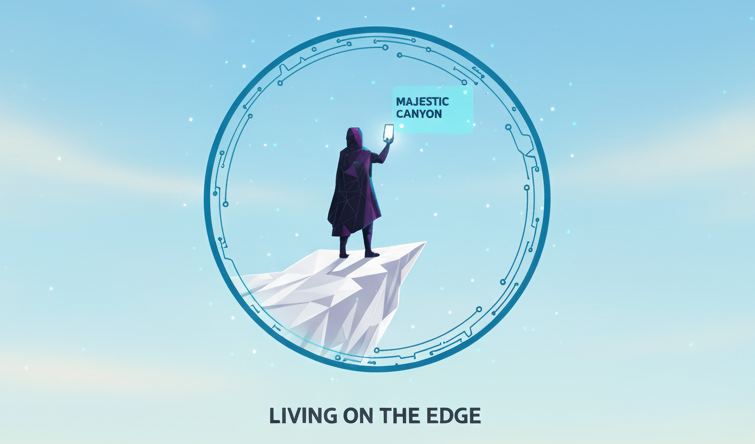
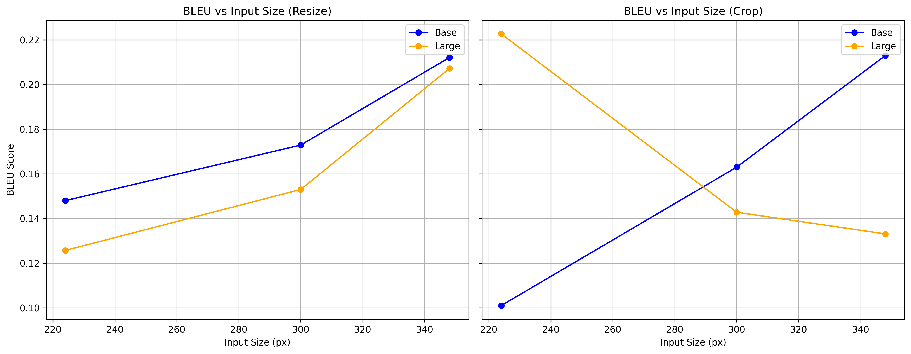
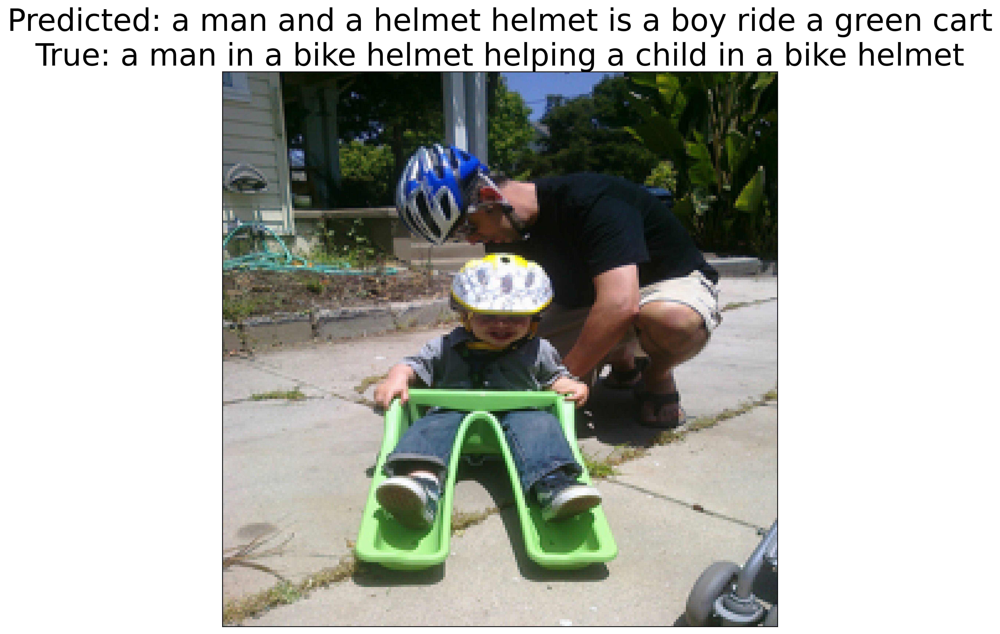
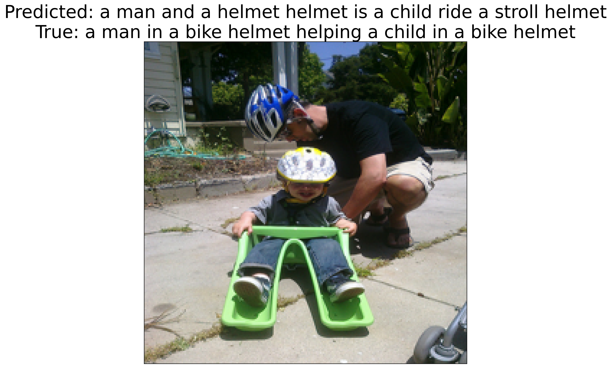
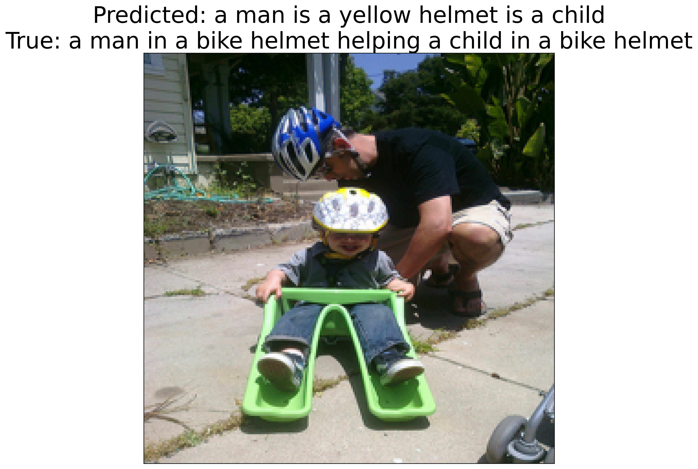
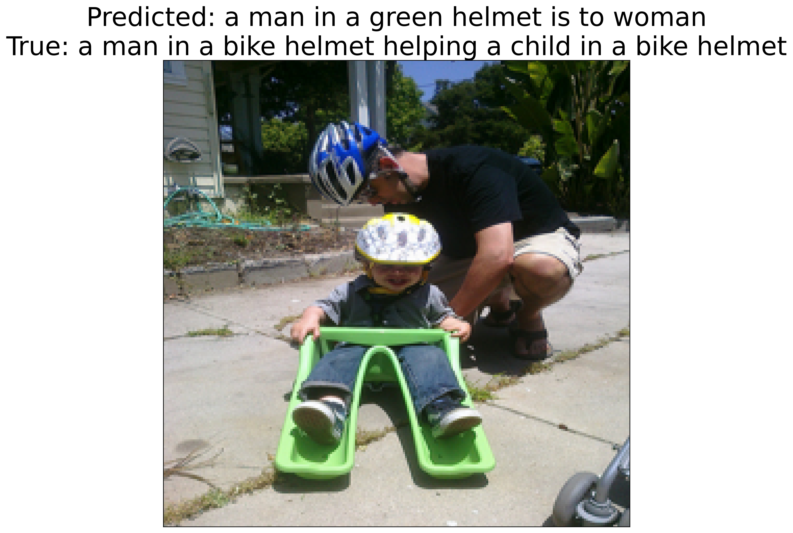
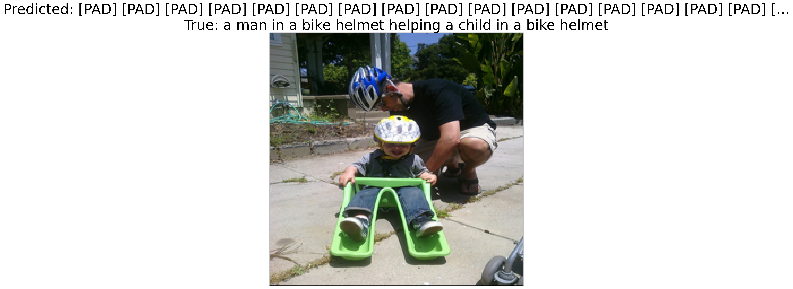
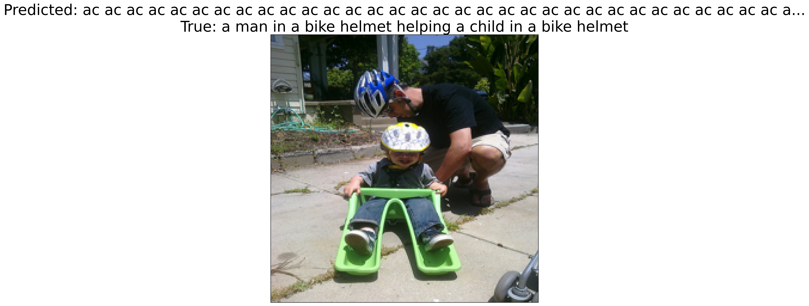

My introduction into the efficiency space was through a course I took at CMU called [On-Device Machine Learning](https://strubell.github.io/teaching/11-767/), co-taught by [Prof. Emma Strubell](https://strubell.github.io) and [Prof. Yonatan Bisk](https://talkingtorobots.com/yonatanbisk.html). I enjoyed this course so much that I ended up TAing for it right after. I learned how to optimize models for low-resource hardware inference through quantization, pruning, and distillation. I also learned how to use parameter-efficient techniques to fine-tune and post-train. For this class's final project, my teammate and I built a lightweight image captioning model that runs on an iPhone with low latency.

## Living on the Edge: On-Device Image Captioning Model
_Team: Vibha Masti, Eesha Shetty_

Motivated by accesibility screen readers, our goal was to create an on-device near real-time image scene description model to run on hardware that is available to everyone. Running our model offline and on-device lets us maintain privacy, while also remaining lightweight with low inference latency. We deployed the model on an iPhone 13 Pro and achieved an inference latency of ~150 ms per image. We used Apple's CoreML [[10](https://developer.apple.com/documentation/coreml)] framework to convert and optimize our model for iOS deployment.

::: {#fig-living-on-the-edge layout-ncol=1}

{width="500" fig-align="center" fig-alt="Living on the Edge logo generated by Gemini nano banana"}

Living on the Edge logo generated by Gemini nano banana
:::

### Background
Image captioning is generally a two-step process: 1: extract image features using a vision encoder, and 2: generate text using a language decoder. For the longest time, CNNs [[13](https://proceedings.neurips.cc/paper/2012/file/c399862d3b9d6b76c8436e924a68c45b-Paper.pdf), [14](https://arxiv.org/abs/1409.1556), [15](https://www.cv-foundation.org/openaccess/content_cvpr_2015/papers/Szegedy_Going_Deeper_With_2015_CVPR_paper.pdf), [16](https://www.cv-foundation.org/openaccess/content_cvpr_2016/papers/He_Deep_Residual_Learning_CVPR_2016_paper.pdf)] remained the de-facto backbone for image downstream tasks, until the introduction of the Vision Transformer (ViT) [[1](https://arxiv.org/abs/2010.11929)]. CLIP introduced contrastive learning to jointly train and align image and text objectives. BLIP [[3](https://arxiv.org/abs/2201.12086)], BLIP-2 [[4](https://arxiv.org/abs/2301.12597)], and CLIPCap [[5](https://arxiv.org/abs/2111.09734)] were introduced shortly after. LightCap [[7](https://arxiv.org/abs/2212.08985)] and MobileViT [[8](https://arxiv.org/abs/2110.02178)] are lightweight architectures for edge devices. Apple has also open-sourced a multi-task neural architecture for on-device scene analysis [[9](https://machinelearning.apple.com/research/on-device-scene-analysis)], built on an optimized MobileNetV3 [[11](https://arxiv.org/abs/1905.02244)] backbone. Camera2Caption [[12](https://ieeexplore.ieee.org/document/8272660)] implemented a simplistic encoder and decoder model for low-power devices.

### Method
We used a subset of the Flickr30k Dataset [[17](https://openaccess.thecvf.com/content_iccv_2015/papers/Plummer_Flickr30k_Entities_Collecting_ICCV_2015_paper.pdf), [18](https://huggingface.co/datasets/ThraggBilly/flickr30k_dataset)] containing 5000 training and 5000 validation samples to fine-tune BLIP. We measured n-gram overlap using BLEU (Bilingual Evaluation Understudy) scores [[19](https://aclanthology.org/P02-1040.pdf)]. We chose BLIP as our baseline model. We tried out both quantization and pruning techniques to optimize our model inference latency and memory footprint. We experimented with different image sizes and downsampling techniques (crop, resize) and compared BLEU scores scross model sizes (base, large). The figure below shows the effects of input size on model performance. 

::: {#fig-image-size layout-ncol=1}

{width="600" fig-align="center" fig-alt="BLEU vs Image Input Size"}

BLEU vs image input size for crop and resize downsampling techniques on BLIP.
:::

We experimented with both post-training quantization and post-training pruning to see what memory and latency reductions we could achieve. We calculated latency by running the CoreML `.mlpackage` model on an iPhone 13 Pro running iOS 17.1.1 using XCode's latency calculator. We used the `coremltoools` Python package to convert our PyTorch model to CoreML and apply optimizations. 

#### Quantization
We converted the PyTorch model first to a compiled graph and then to a CoreML Model Package (`.mlpackage`). We applied post-training linear quantization on weights (not activations) from 32-bit float to 16-bit float and 8-bit int and measure latency and model disk size. 

| **Measure**            | **fp32** | **fp16** | **int8** |
|------------------------|----------|----------|----------|
| Inference Latency (ms) |  238.84  | 143.06   | 142.46   |
| Model Size (MB)        |  989.9   | 448.3    | 226.2    |

: Comparison of Non-Quantized (fp32) and Quantized (fp16, int8) Models

#### Pruning
We performed iterative unstructured magnitude pruning at a sparsity of 20% on our fine-tuned model and compared BLEU, disk size, and latency. We measure BLEU by against the validation dataset by running on MacOS and continue to measure latency on an iPhone 13 Pro. We see a significant drop in BLEU after 48.8% sparsity.

| **Iteration** | **Sparsity (%)** | **BLEU** | **Latency (ms)** | **Disk Size (MB)** |
|---------------|------------------|----------|------------------|--------------------|
| 0             | 0.0%             | 0.241    | 238.84           | 989.92             |
| 1             | 20.0%            | 0.236    | 400.37           | 823.21             |
| 2             | 36.0%            | 0.172    | 318.12           | 665.55             |
| 3             | 48.8%            | 0.072    | 321.07           | 539.44             |
| 4             | 59.0%            | 0.000    | 301.12           | 438.01             |
| 5             | 67.2%            | 0.000    | 323.74           | 357.29             |
: Performance Metrics at Different Sparsity Levels

We also run a layer-based sensitivity analysis to compare the effects of pruning embedding/convolution layers. Interestingly, we see that increased sparsity in embedding layers slows down inference, but increased sparsity in convolutional layers speeds it up. Both pruning techniques lead to an overall increase in latency, which is likely due to the overhead of handling sparse matrices on mobile hardware.

::: {#fig-pruning layout-ncol=2}

{fig-alt="0% Sparisty"}

{fig-alt="20% Sparisty"}

{fig-alt="40% Sparisty"}

{fig-alt="48.8% Sparisty"}

{fig-alt="59% Sparisty"}

{fig-alt="67.2% Sparisty"}

Example captions generated at different sparsity levels
:::

| **Pruned Layers** | **Sparsity (%)** | **BLEU** | **Latency (ms)** | **Disk Size (MB)** |
|-------------------|------------------|----------|------------------|--------------------|
| Conv              | 20.0%            | 0.2406   | 281.04           | 972.83             |
| Conv              | 40.0%            | 0.2220   | 264.68           | 953.18             |
| Embedding         | 20.0%            | 0.2406   | 275.90           | 972.83             |
| Embedding         | 40.0%            | 0.2220   | 280.68           | 953.18             |

: Sensitivity Analysis of Pruning Embedding and Convolution Layers

### Conclusion
The overall best model we found was the int8 quantized model with an inference latency of 142.46 ms and a disk size of 226.2 MB. We found that pruning did not help with latency, but quantization did. We also found that resizing the image to 348x348 led to the best BLEU score.

## References

1. Dosovitskiy, A., Beyer, L., Kolesnikov, A., et al. (2020). [An Image is Worth 16x16 Words: Transformers for Image Recognition at Scale](https://arxiv.org/abs/2010.11929) 

2. Radford, A., Kim, J. W., Hallacy, C., et al. (2021). [Learning Transferable Visual Models From Natural Language Supervision](https://arxiv.org/abs/2103.00020)

3. Li, J., Li, D., Xiong, C., & Hoi, S. (2022). [BLIP: Bootstrapping Language-Image Pre-training for Unified Vision-Language Understanding and Generation](https://arxiv.org/abs/2201.12086)

4. Li, J., Li, D., Savarese, S., & Hoi, S. (2023). [BLIP-2: Bootstrapping Language-Image Pre-training with Frozen Image Encoders and Large Language Models](https://arxiv.org/abs/2301.12597)

5. Mokady, R., Hertz, A., & Bermano, A. H. (2021). [CLIPCap: CLIP Prefix for Image Captioning](https://arxiv.org/abs/2111.09734)

6. Radford, A., Wu, J., Child, R., et al. (2019). [Language Models are Unsupervised Multitask Learners](https://cdn.openai.com/better-language-models/language_models_are_unsupervised_multitask_learners.pdf), OpenAI Blog

7. Wang, N., Xie, J., Luo, H., et al. (2023). [Efficient Image Captioning for Edge Devices](https://arxiv.org/abs/2212.08985)

8. Mehta, S., & Rastegari, M. (2021). [MobileViT: Light-weight, General-purpose, and Mobile-friendly Vision Transformer](https://arxiv.org/abs/2110.02178)

9. Apple. (2022). [A multi-task neural architecture for on-device scene analysis](https://machinelearning.apple.com/research/on-device-scene-analysis)

10. Apple. [CoreML Documentation](https://developer.apple.com/documentation/coreml)

11. Howard, A., Sandler, M., Chu, G., et al. (2019). [Searching for MobileNetV3](https://arxiv.org/abs/1905.02244)

12. Mathur, P., Gill, A., Yadav, A., et al. (2017). [Camera2Caption: a real-time image caption generator](https://ieeexplore.ieee.org/document/8272660)

13. Krizhevsky, A., Sutskever, I., & Hinton, G. E. (2012). [ImageNet Classification with Deep Convolutional Neural Networks](https://proceedings.neurips.cc/paper/2012/file/c399862d3b9d6b76c8436e924a68c45b-Paper.pdf)

14. Simonyan, K., & Zisserman, A. (2014). [Very Deep Convolutional Networks for Large-Scale Image Recognition](https://arxiv.org/abs/1409.1556)

15.  Szegedy, C., Liu, W., Jia, Y., et al. (2015). [Going Deeper with Convolutions](https://www.cv-foundation.org/openaccess/content_cvpr_2015/papers/Szegedy_Going_Deeper_With_2015_CVPR_paper.pdf)

16. He, K., Zhang, X., Ren, S., & Sun, J. (2016). [Deep Residual Learning for Image Recognition](https://www.cv-foundation.org/openaccess/content_cvpr_2016/papers/He_Deep_Residual_Learning_CVPR_2016_paper.pdf)

17. Plummer, B. A., Wang, L., Cervantes, C. M., Caicedo, J. C., Hockenmaier, J., & Lazebnik, S. (2015). [Flickr30k entities: Collecting region-to-phrase correspondences for richer image-to-sentence models](https://openaccess.thecvf.com/content_iccv_2015/papers/Plummer_Flickr30k_Entities_Collecting_ICCV_2015_paper.pdf). In Proceedings of the IEEE international conference on computer vision. 

18. HuggingFace. [Flickr30k Dataset](https://huggingface.co/datasets/ThraggBilly/flickr30k_dataset)

19. Papineni, K., Roukos, S., Ward, T., & Zhu, W. J. (2002,). [Bleu: a method for automatic evaluation of machine translation](https://aclanthology.org/P02-1040.Pdf). In Proceedings of the 40th annual meeting of the Association for Computational Linguistics (pp. 311-318).
