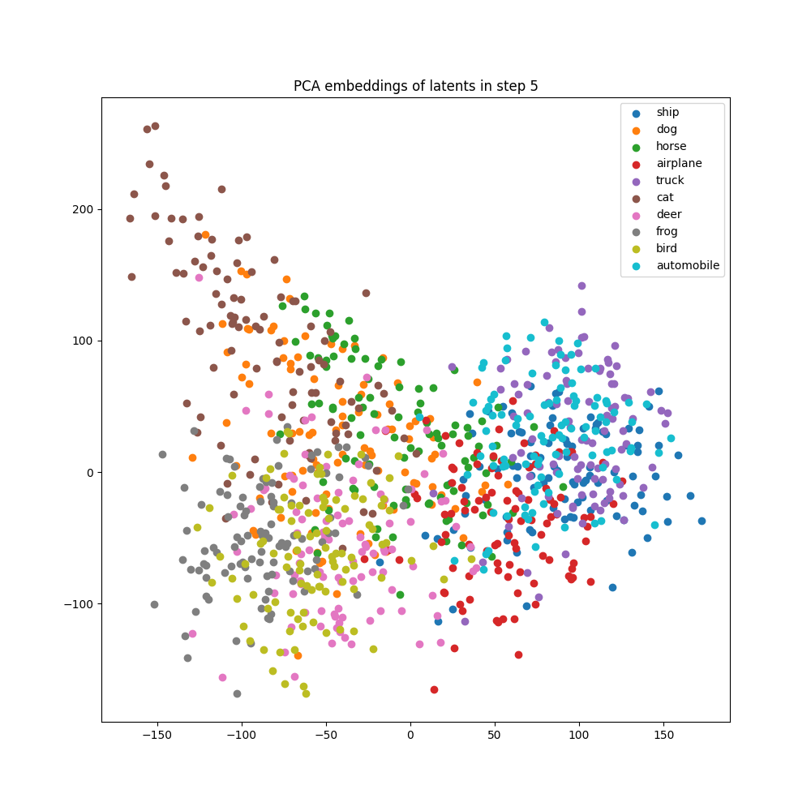
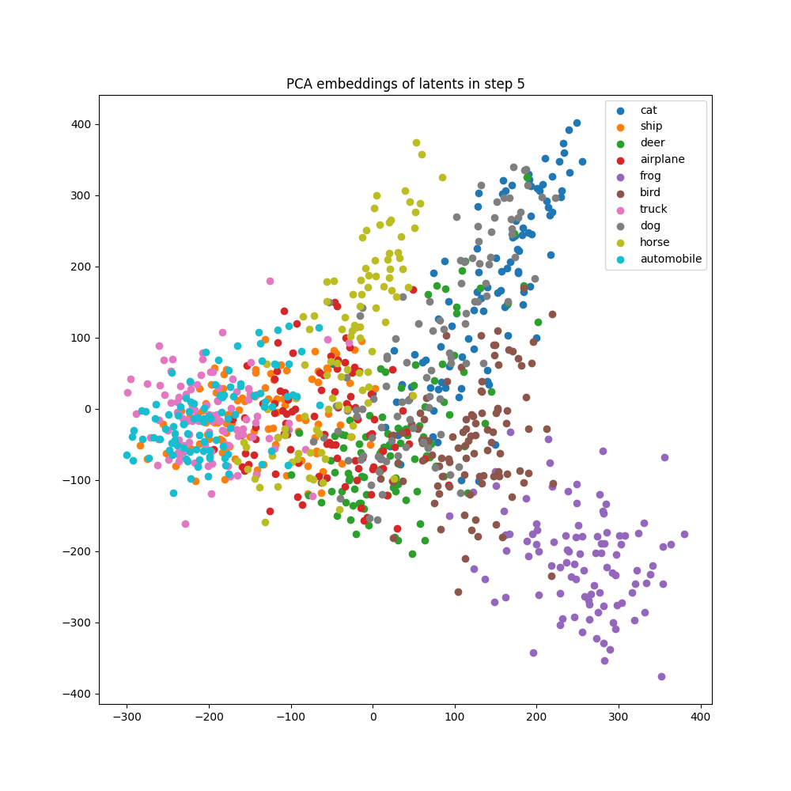

_Collaborator: Yingshang Chang · Advisor: [Prof. Yonatan Bisk](https://talkingtorobots.com/yonatanbisk.html)_

This was an independent research exploration I worked on with Yingshang Chang, advised by Prof. Yonatan Bisk at CMU's Language Technologies Institute. Below is the report in my own words, ported over from the draft.

## Introduction

Developments in text-to-image generation models have shown very impressive results in creative image generation (Betker et al., 2023). While the qualitative results of these models are quite impressive, the community lacks a rigorous evaluation criterion that assesses a model's alignment with text prompts. For example, while most models are quite good at generating images containing different objects (e.g. *a photo of a cow*), many models tend to struggle with the positioning of objects in images (e.g. *on the left* vs *right*) or in changes to agency (e.g. *man biting a dog*). In some sense, this result is intuitive as it has been shown that word order matters very little in transformers (Sinha et al., 2021), meaning that two sentences with the exact same words ordered differently likely have the same meaning to most language models.

Existing common practices in the automatic evaluation of image-text alignment leverage the encoding space of another image understanding model such as CLIP (Radford et al., 2021; Hessel et al., 2021). However, intuitively speaking, since image generation models are typically capable of producing images belonging to various visual categories (e.g. object class, color, relations), they must also be able to represent these distinct categories in their own encoding spaces. In this work, we aim to find such intrinsic representations within diffusion models that can accurately reflect semantic separation along different axes -- objects, colors, counting, and relative positioning -- and see how well they align to the model's true ability to produce these distinct classes.

There arise two natural questions about the represented semantic knowledge: 1) where to locate such knowledge and 2) the ease of extracting such knowledge. Answering these questions will bring practical benefits: 1) the evaluation of generative models will no longer rely on an outside model's encoding space, becoming more faithful to the generative model's internal space, and 2) discovering knowledge-containing vectors in a generative model will facilitate knowledge transfer from generative to discriminative vision tasks.

## Related Work

### Text-to-Image Generation

There have been tremendous improvements in the abilities of text-guided image generation models since their inception. Early text-conditioned image generation models utilized VAEs (Kingma & Welling, 2013; Mansimov et al., 2015) and GANs (Goodfellow et al., 2020). More recent approaches have explored multimodal Transformers (Vaswani et al., 2017), taking inspiration from large language models (Ramesh et al., 2021; Yu et al., 2022; Gafni et al., 2022; Chang et al., 2023; Kenton & Toutanova, 2019; Yu et al., 2023; Chang et al., 2022; Yasunaga et al., 2022; Yu et al., 2023; Kim et al., 2021; Dayma et al., 2021).

Diffusion models, based on principles of thermodynamics (Ho et al., 2020; Sohl-Dickstein et al., 2015), have demonstrated incredible high-quality creative image generation abilities (Nichol et al., 2022; Saharia et al., 2022; Ramesh et al., 2022; Kakao Brain, 2022; Betker et al., 2023; Rombach et al., 2022; Rampas et al., 2023; DeepFloyd, 2023).

### Evaluation of Text-to-Image Models

Evaluating synthetically generated images with human evaluators is the still gold standard for most multimodal generative models. Automated quantitative evaluation of text-to-image models still remains a challenge. Typically, automated evaluations are performed by measuring one or more of the following -- image-text alignment, image quality, and text-text alignment (with an auxiliary image captioning model for the generated images).

#### Image Quality

Two popular metrics for measuring generated image quality are Inception Score (IS) (Salimans et al., 2016) and Fréchet Inception Distance (FID) (Heusel et al., 2017). The Classification Accuracy Score (CAS) (Ravuri & Vinyals, 2019) metric uses synthetically generated images to train a ResNet (He et al., 2016) image classification model, and performs inference on real images. CLIP Maximum Mean Discrepancy (CMMD) (Jayasumana et al., 2023) was proposed as an alternative metric to FID that can better capture generated image quality.

#### Image-Text Alignment

Xu et al. (2018) proposed to use R-precision to evaluate retrieval results. Zhang et al. (2018) defined a metric called Visual-Semantic Similarity (VS Similarity), which used a trained a visual-semantic embedding model to measure the distance between input text and generated images. Hinz et al. (2020) introduced Semantic Object Accuracy (SOA), which uses a pre-trained object detection model to check if objects mentioned in the caption are present in the generated image. CLIP-Score (Hessel et al., 2021) uses CLIP (Radford et al., 2021) to compute the cosine similarity between the text prompt's encoding and the generated image's encoding. However, the metric has proven ineffective at counting (Radford et al., 2021), performing better than chance at the Winoground (Thrush et al., 2022) task, and distinguishing visually dissimilar image pairs (Tong et al., 2024).

## Experiments

We ran experiments to try and find a representative intrinsic indicator of semantic separation in open latent diffusion models in the stable diffusion (Rombach et al., 2022) family. We explore different types of separation by varying the following in prompts -- objects, colors, counts, positioning. We detail each experiment and its findings below.

::: {#fig-embeddings layout-ncol=2}

{fig-alt="Cross-attention downblock embeddings for SDv1.5 midway through diffusion, colored by object class"}

{fig-alt="Cross-attention downblock embeddings for SDv2.1 midway through diffusion, colored by object class"}

CAD embeddings formed midway through the diffusion process
:::

### Final Denoised Latent (FDL)

This approach involved comparing the final latent vector after all denoising diffusion steps for a given prompt to the latent vector of a real image passed through the image encoder. For each prompt-image pair, the prompt is passed into the diffusion pipeline to generate a latent vector called $z_{gen}$. A corresponding real image for the prompt is passed through the image encoder of the diffusion pipeline to obtain $z_{real}$. The real images were obtained from a CIFAR-10 subset (object) and GPT-4 (color, count, position). We then computed the cosine similarity score between the generated image latent and the real image latent.

For each of the variation types -- objects, colors, counts, and position -- appropriate prompts for image generation were constructed as shown in the table below. To measure semantic separation, we generated latents for a contrasting pair of image prompt variations (eg: *"A photo of a bird"* and *"A photo of a frog"*) and computed pairwise cosine similarity scores from the Cartesian product $\{z_{gen0}, z_{gen1}\} \times \{z_{real0}, z_{real1}\}$.

We defined our metric, which we call the ratio score, as shown in the equation below. The $+ 2$ terms are to normalize the scores to be in the $[0, 1]$ range. A score $> 1$ indicates that the matching pairs of generated and real latents are closer than the contrasting pairs (indicating that the representation is good), and a score $< 1$ indicates that the contrasting pairs of generated and real latents are closer than the matching pairs (indicating that the representation is not good).

| Type | Prompt template | Variations of `<c>` |
|---|---|---|
| Object | A photo of a `<c>` | airplane, automobile, bird, cat, deer, dog, frog, horse, ship, truck |
| Color | A photo of a `<c>` ball | red, green, blue, yellow, purple, orange, brown, pink, black, white |
| Count | A photo of `<c>` ball(s) | one, two, three, four, five |
| Position | A photo of a ball `<c>` a bat | to the left of, to the right of, on top of, below, in front of, behind |

: Variations along different axes (CIFAR-10 classes for objects)

$$
\dfrac{\text{sim}(z_{gen0}, z_{real0}) + \text{sim}(z_{gen1}, z_{real1}) + 2}{\text{sim}(z_{gen0}, z_{real1}) + \text{sim}(z_{gen1}, z_{real0}) + 2 + \epsilon}
$$

### Diffusion Classifier Noise (DCN)

Using the idea behind the diffusion classifier (Li et al., 2023), we compared the noise prediction errors of a contrastive pair of prompts from the table above. Similar to the FDL ratio score, this measure also requires real images. For a chosen image of a certain variation, a positive prompt and negative prompt are created (eg: for an image of a violin, positive: *"A photo of a violin"* and negative: *"A photo of a hammer"*). Each image is noised and then conditionally denoised on both the positive and negative prompts. The average noise prediction errors on both prompts over all denoising timesteps is calculated for a single image and the predicted class is the class with a lower error. The DC score of the model is determined as the accuracy of predicting the positive class for all images in the real image dataset.

### Cross-Attention Downblock (CAD)

Unlike the FDL and DCN approaches, this approach does not require any corresponding real images. For every prompt variation in the table above, the intermediate cross-attention downblock embedding vectors (embeddings of the last downblock layer in the U-Net) are stored and flattened, and the quality of the formed clusters are assessed. More specifically, for each variation in every type, 100 image generation processes are run and the cross-attention downblock embeddings of 10 intermediate diffusion steps are stored. We look at the midway point of diffusion and use those embeddings.

To measure a notion of semantic separation among classes, we compute the mean Silhouette coefficient (Rousseeuw, 1987) of the clusters. A value of 1 indicates good separation of clusters, and a value of -1 indicates poor cluster assignment. A value close to 0 indicates overlapping clusters.

## Results

The values of the Final Denoised Latent Ratio (FDL), Diffusion Classifier Noise (DCN), and Cross-Attention Downblock Silhouette (CAD) scores are obtained for the concepts of objects in the table below.

| Model | FDL | DCN | CAD | CLIP-S |
|---|---|---|---|---|
| SD-1.1 | 1.010 | 0.527 | 0.008 | 0.285 |
| SD-1.2 | 1.025 | 0.555 | 0.005 | 0.288 |
| SD-1.3 | 1.021 | 0.570 | 0.008 | 0.287 |
| SD-1.4 | 1.020 | 0.539 | 0.010 | 0.287 |
| SD-1.5 | 1.011 | 0.541 | 0.010 | 0.285 |
| SD-2.0 | 1.012 | 0.583 | 0.004 | 0.287 |
| SD-2.1 | 1.019 | 0.526 | 0.013 | 0.286 |

: Average scores on object concepts

After inspecting the proposed measures of contrastive comparison, we find that there is no clear separation of object/color/count/position concepts in any of these latent spaces. Looking at each class more closely, we see that for the object axis, the cross-attention downblock embeddings show some meaningful overlaps for certain class clusters. As seen in the figure above, we see clusters formed out of [{ship, truck, automobile, airplane}, {horse, deer}, {bird, frog}, {cat, dog}].

## References

1. Betker, J., Goh, G., Jing, L., et al. (2023). Improving image generation with better captions. *Computer Science*.

2. Sinha, K., Jia, R., Hupkes, D., Pineau, J., Williams, A., & Kiela, D. (2021). [Masked Language Modeling and the Distributional Hypothesis: Order Word Matters Pre-training for Little](https://aclanthology.org/2021.emnlp-main.230/). In Proceedings of the 2021 Conference on Empirical Methods in Natural Language Processing.

3. Radford, A., Kim, J. W., Hallacy, C., et al. (2021). [Learning Transferable Visual Models From Natural Language Supervision](https://arxiv.org/abs/2103.00020). In International Conference on Machine Learning.

4. Hessel, J., Holtzman, A., Forbes, M., Le Bras, R., & Choi, Y. (2021). [CLIPScore: A Reference-free Evaluation Metric for Image Captioning](https://arxiv.org/abs/2104.08718). In Proceedings of the 2021 Conference on Empirical Methods in Natural Language Processing.

5. Kingma, D. P., & Welling, M. (2013). [Auto-Encoding Variational Bayes](https://arxiv.org/abs/1312.6114). arXiv preprint arXiv:1312.6114.

6. Mansimov, E., Parisotto, E., Ba, J. L., & Salakhutdinov, R. (2016). [Generating Images from Captions with Attention](https://arxiv.org/abs/1511.02793). In International Conference on Learning Representations (ICLR).

7. Goodfellow, I., Pouget-Abadie, J., Mirza, M., et al. (2020). [Generative Adversarial Networks](https://arxiv.org/abs/1406.2661). Communications of the ACM, 63(11), 139-144.

8. Vaswani, A., Shazeer, N., Parmar, N., et al. (2017). [Attention Is All You Need](https://arxiv.org/abs/1706.03762). Advances in Neural Information Processing Systems, 30.

9. Ramesh, A., Pavlov, M., Goh, G., et al. (2021). [Zero-Shot Text-to-Image Generation](https://arxiv.org/abs/2102.12092). In International Conference on Machine Learning.

10. Yu, J., Xu, Y., Koh, J. Y., et al. (2022). [Scaling Autoregressive Models for Content-Rich Text-to-Image Generation](https://arxiv.org/abs/2206.10789). Transactions on Machine Learning Research.

11. Gafni, O., Polyak, A., Ashual, O., Sheynin, S., Parikh, D., & Taigman, Y. (2022). [Make-A-Scene: Scene-Based Text-to-Image Generation with Human Priors](https://arxiv.org/abs/2203.13131). In European Conference on Computer Vision.

12. Chang, H., Zhang, H., Barber, J., et al. (2023). [Muse: Text-To-Image Generation via Masked Generative Transformers](https://arxiv.org/abs/2301.00704). In Proceedings of the 40th International Conference on Machine Learning (ICML).

13. Devlin, J., & Toutanova, K. (2019). [BERT: Pre-training of Deep Bidirectional Transformers for Language Understanding](https://arxiv.org/abs/1810.04805). In Proceedings of NAACL-HLT.

14. Yu, L., Shi, B., Pasunuru, R., et al. (2023). [Scaling Autoregressive Multi-Modal Models: Pretraining and Instruction Tuning](https://arxiv.org/abs/2309.02591). arXiv preprint arXiv:2309.02591.

15. Chang, H., Zhang, H., Jiang, L., Liu, C., & Freeman, W. T. (2022). [MaskGIT: Masked Generative Image Transformer](https://arxiv.org/abs/2202.04200). In The IEEE Conference on Computer Vision and Pattern Recognition (CVPR).

16. Yasunaga, M., Aghajanyan, A., Shi, W., et al. (2022). [Retrieval-Augmented Multimodal Language Modeling](https://arxiv.org/abs/2211.12561). arXiv preprint arXiv:2211.12561.

17. Kim, S., Cho, S., Kim, C., Lee, D., & Baek, W. (2021). [minDALL-E on Conceptual Captions](https://github.com/kakaobrain/minDALL-E).

18. Dayma, B., Patil, S., Cuenca, P., et al. (2021). [DALL·E Mini](https://github.com/borisdayma/dalle-mini).

19. Ho, J., Jain, A., & Abbeel, P. (2020). [Denoising Diffusion Probabilistic Models](https://arxiv.org/abs/2006.11239). Advances in Neural Information Processing Systems, 33, 6840-6851.

20. Sohl-Dickstein, J., Weiss, E., Maheswaranathan, N., & Ganguli, S. (2015). [Deep Unsupervised Learning using Nonequilibrium Thermodynamics](https://arxiv.org/abs/1503.03585). In International Conference on Machine Learning.

21. Nichol, A. Q., Dhariwal, P., Ramesh, A., et al. (2022). [GLIDE: Towards Photorealistic Image Generation and Editing with Text-Guided Diffusion Models](https://arxiv.org/abs/2112.10741). In International Conference on Machine Learning.

22. Saharia, C., Chan, W., Saxena, S., et al. (2022). [Photorealistic Text-to-Image Diffusion Models with Deep Language Understanding](https://arxiv.org/abs/2205.11487). Advances in Neural Information Processing Systems, 35, 36479-36494.

23. Ramesh, A., Dhariwal, P., Nichol, A., Chu, C., & Chen, M. (2022). [Hierarchical Text-Conditional Image Generation with CLIP Latents](https://arxiv.org/abs/2204.06125). arXiv preprint arXiv:2204.06125.

24. Lee, D., Kim, J., Choi, J., Kim, J., Byeon, M., Baek, W., & Kim, S. (2022). [Karlo-v1.0.alpha on COYO-100M and CC15M](https://github.com/kakaobrain/karlo).

25. Rombach, R., Blattmann, A., Lorenz, D., Esser, P., & Ommer, B. (2022). [High-Resolution Image Synthesis with Latent Diffusion Models](https://arxiv.org/abs/2112.10752). In Proceedings of the IEEE/CVF Conference on Computer Vision and Pattern Recognition.

26. Rampas, D., Pernias, P., & Aubreville, M. (2023). [A Novel Sampling Scheme for Text- and Image-Conditional Image Synthesis in Quantized Latent Spaces](https://arxiv.org/abs/2211.07292). arXiv preprint arXiv:2211.07292.

27. DeepFloyd. (2024). [DeepFloyd-IF](https://github.com/deep-floyd/IF).

28. Salimans, T., Goodfellow, I., Zaremba, W., Cheung, V., Radford, A., & Chen, X. (2016). [Improved Techniques for Training GANs](https://arxiv.org/abs/1606.03498). Advances in Neural Information Processing Systems, 29.

29. Heusel, M., Ramsauer, H., Unterthiner, T., Nessler, B., & Hochreiter, S. (2017). [GANs Trained by a Two Time-Scale Update Rule Converge to a Local Nash Equilibrium](https://arxiv.org/abs/1706.08500). Advances in Neural Information Processing Systems, 30.

30. Ravuri, S., & Vinyals, O. (2019). [Classification Accuracy Score for Conditional Generative Models](https://arxiv.org/abs/1905.10887). Advances in Neural Information Processing Systems, 32.

31. He, K., Zhang, X., Ren, S., & Sun, J. (2016). [Deep Residual Learning for Image Recognition](https://arxiv.org/abs/1512.03385). In Proceedings of the IEEE Conference on Computer Vision and Pattern Recognition.

32. Jayasumana, S., Ramalingam, S., Veit, A., Glasner, D., Chakrabarti, A., & Kumar, S. (2023). [Rethinking FID: Towards a Better Evaluation Metric for Image Generation](https://arxiv.org/abs/2401.09603). arXiv preprint arXiv:2401.09603.

33. Xu, T., Zhang, P., Huang, Q., Zhang, H., Gan, Z., Huang, X., & He, X. (2018). [AttnGAN: Fine-Grained Text to Image Generation with Attentional Generative Adversarial Networks](https://arxiv.org/abs/1711.10485). In Proceedings of the IEEE Conference on Computer Vision and Pattern Recognition.

34. Zhang, Z., Xie, Y., & Yang, L. (2018). [Photographic Text-to-Image Synthesis with a Hierarchically-nested Adversarial Network](https://arxiv.org/abs/1802.09178). In Proceedings of the IEEE Conference on Computer Vision and Pattern Recognition.

35. Hinz, T., Heinrich, S., & Wermter, S. (2020). [Semantic Object Accuracy for Generative Text-to-Image Synthesis](https://arxiv.org/abs/1910.13321). IEEE Transactions on Pattern Analysis and Machine Intelligence, 44(3), 1552-1565.

36. Thrush, T., Jiang, R., Bartolo, M., Singh, A., Williams, A., Kiela, D., & Ross, C. (2022). [Winoground: Probing Vision and Language Models for Visio-Linguistic Compositionality](https://arxiv.org/abs/2204.03162). In Proceedings of the IEEE/CVF Conference on Computer Vision and Pattern Recognition.

37. Tong, S., Liu, Z., Zhai, Y., Ma, Y., LeCun, Y., & Xie, S. (2024). [Eyes Wide Shut? Exploring the Visual Shortcomings of Multimodal LLMs](https://arxiv.org/abs/2401.06209). arXiv preprint arXiv:2401.06209.

38. Li, A. C., Prabhudesai, M., Duggal, S., Brown, E., & Pathak, D. (2023). [Your Diffusion Model is Secretly a Zero-Shot Classifier](https://arxiv.org/abs/2303.16203). In Proceedings of the IEEE/CVF International Conference on Computer Vision.

39. Rousseeuw, P. J. (1987). [Silhouettes: A Graphical Aid to the Interpretation and Validation of Cluster Analysis](https://www.sciencedirect.com/science/article/pii/0377042787901257). Journal of Computational and Applied Mathematics, 20, 53-65.

40. Krizhevsky, A., & Hinton, G. (2009). [Learning Multiple Layers of Features from Tiny Images](https://www.cs.toronto.edu/~kriz/learning-features-2009-TR.pdf).

41. Yu, L., Lezama, J., Gundavarapu, N. B., et al. (2024). [Language Model Beats Diffusion -- Tokenizer is Key to Visual Generation](https://arxiv.org/abs/2310.05737). In International Conference on Learning Representations (ICLR).
